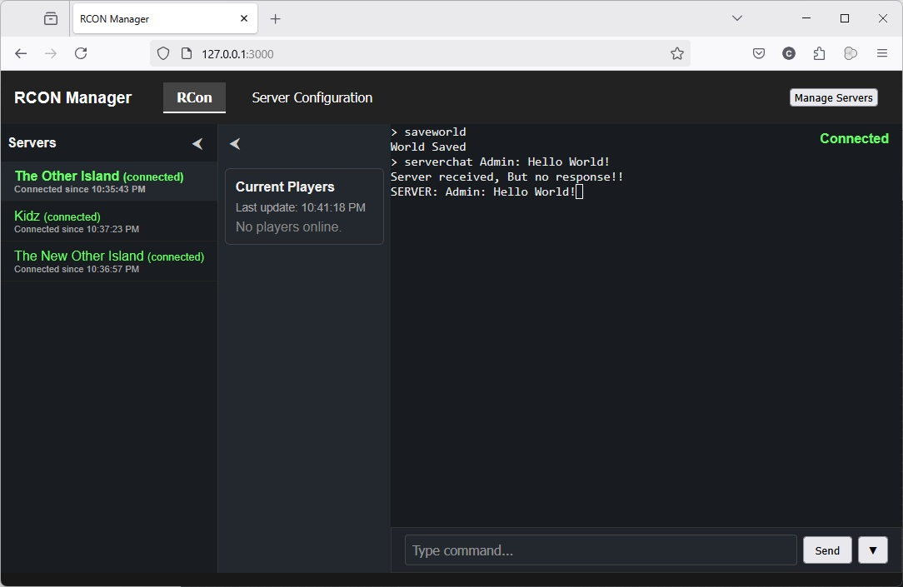

# Node.js RCON Manager



A RCON manager for game servers, with a persistent Node.js backend and a React + xterm.js frontend. Supports multiple server profiles, live player lists, chat, and more.
Right now we are focusing on ARK Survival Ascended

---

## Features

- **Persistent RCON Connections**: Manages multiple game servers, auto-reconnects on disconnect.
- **Web UI**: React frontend with xterm.js terminals, resizable layout, and tabbed server sessions.
- **Live Player List**: See current players (for ARK SE/SA) with live updates.
- **Chat Integration**: View in-game chat in real time.
- **Server Management**: Add/edit/remove servers.

---

## Getting Started


### 1. Install Git (if you don't have it)

Download and install Git from [git-scm.com](https://git-scm.com/downloads) for your platform.

### 2. Install Node.js (if you don't have it)

Download and install Node.js (includes npm) from [nodejs.org](https://nodejs.org/en/download/) for your platform.

### 3. Clone the Repository


```sh
git clone https://github.com/malkamius/node_rcon.git
cd node_rcon
```


### 4. Install Dependencies


```sh
npm install
```


### 5. Build the Project

Build both backend and frontend:

```sh
npm run build
```

Or build separately:

```sh
npm run build:backend
npm run build:frontend
```


### 6. Run the Backend

```sh
npm start
```

The backend will start the web server and manage RCON connections.

### 5. Open the Frontend

Visit [http://localhost:3000](http://localhost:3000) (or your configured host/port) in your browser.

---

## Usage

- **Tabs**: Each server has its own tab with a terminal and status bar.
- **Toolbar**: Use the toolbar to manage servers
- **Server Management**: Add/edit/remove servers in the modal dialog (changes are live).
- **Player List**: If enabled, see a live-updating list of players.
- **Chat**: In-game chat messages appear in the terminal.
- **Reconnect**: If the frontend loses connection to the backend, a modal will appear and auto-retry every 5 seconds.

---

## Development

- **Backend**: TypeScript, Express, rcon-client
- **Frontend**: React, TypeScript, xterm.js, Material-UI
- **Build**: Uses Webpack for frontend bundling

### Debugging

VS Code debug configuration is available for backend (Node.js) with `--inspect-brk` for breakpoints and inspection.

---

## License

MIT License. See [LICENSE](LICENSE) for details.

---

## Credits

- [xterm.js](https://xtermjs.org/)
- [rcon-client](https://www.npmjs.com/package/rcon-client)
- [React](https://react.dev/)

---

## Screenshot


