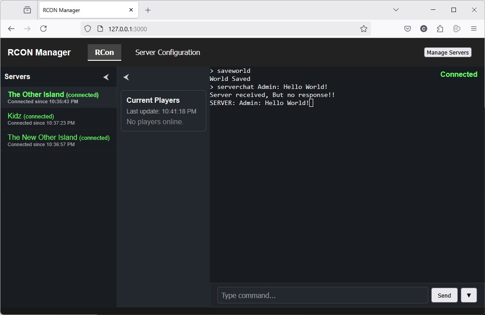
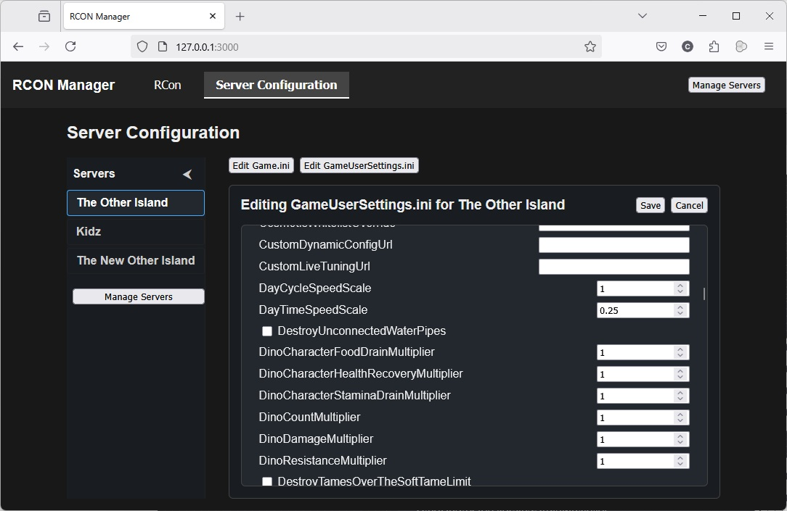

# Installation Notes

After running `npm install`, you do **not** need to run a separate build step. The install process will:

- Automatically build the project (backend and frontend)
- Register the backend service as a Windows scheduled task (runs as SYSTEM)
- Register the instance installation socket service (admin socket server) as a Windows scheduled task

Both services are set up and started automatically.
No manual build or service registration is required after install.
# Node.js RCON Manager



A RCON manager for game servers, with a persistent Node.js backend and a React + xterm.js frontend. Supports multiple server profiles, live player lists, chat, and more.
Right now we are focusing on ARK Survival Ascended

---

## Features

- **Persistent RCON Connections**: Manages multiple game servers, auto-reconnects on disconnect.
- **Web UI**: React frontend with xterm.js terminals, resizable layout, and tabbed server sessions.
- **Live Player List**: See current players (for ARK SE/SA) with live updates.
- **Chat Integration**: View in-game chat in real time.
- **Server Management**: Add/edit/remove servers.
- **Local Server Settings**: Edit basic settings(Game/GameUserSettings) of the dedicated server if running on the same box.
- **Hot Reload Config**: Watches `config.json` on disk with debouncing, automatically updating profiles and broadcasting changes via WebSockets without restarting the backend.
- **Multi-Server Command Broadcasting**: Dispatch RCON commands simultaneously across multiple selected servers with aggregate ANSI-formatted terminal feedback.
- **Deep URL Routing & Server Bookmarks**: Direct URL hash navigation to specific servers and dedicated reconnect modal dialogs.
- **Automated Base Install & Steam Update Detection**: Background polling and notifications when new server build IDs are released.
- **INI Revision History & Safe Backups**: Historical snapshot management, preview diffs, and one-click configuration restore.
- **Live Crash & Engine Log Viewer**: Tail and search `ShooterGame.log` and crash dumps directly in the UI.
- **RCON Script Engine & Templates**: Create, save, and execute multi-step RCON maintenance routines with variable interpolation.

---

## Getting Started


### 1. Install Git (if you don't have it)

Download and install Git from [git-scm.com](https://git-scm.com/downloads) for your platform.

### 2. Install Node.js (if you don't have it)

Download and install Node.js (includes npm) from [nodejs.org](https://nodejs.org/en/download/) for your platform.

### 3. Clone the Repository


```sh
git clone https://github.com/malkamius/node_rcon.git
cd node_rcon
```

### 4. Install Dependencies


```sh
npm install
```


### 4.5 (Windows Only)
Start a PowerShell as administrator and execute:
```sh
Set-ExecutionPolicy -ExecutionPolicy RemoteSigned
```

---

## SteamCMD Installation

To install SteamCMD, use the provided Node.js script:

```sh
node install-steamcmd.js <install-directory>
```

This will download and extract SteamCMD to the specified directory. The old PowerShell script is now deprecated.
if you are unable to run npm

### 5. Build the Project

Build both backend and frontend:

```sh
npm run build
```

Or build separately:

```sh
npm run build:backend
npm run build:frontend
```


### 6. Run the Backend

```sh
npm start
```

The backend will start the web server and manage RCON connections.

### 5. Open the Frontend

Visit [http://localhost:3000](http://localhost:3000) (or your configured host/port) in your browser.

## Authentication

The web UI requires authentication even when opened from `localhost`; localhost is not treated as an authentication bypass. The first SSO login becomes the administrator. Local accounts can be managed by an administrator through `POST/GET /api/auth/users`. If the web server is bound to `0.0.0.0` and no accounts exist, set the master password from the local machine using the setup screen or `POST /api/auth/master-password`; changes are loopback-only and require the current password once one is set.

The optional shared SSO UI/helper is maintained at [github.com/kbs-cloud/shared](https://github.com/kbs-cloud/shared). It is not required to build this project. To extend the built-in SSO redirect, clone, fork, or download that repository, then integrate the authentication helpers from its `auth` directory into the frontend as a separate optional step.

SSO uses the deployed provider at [auth.kbs-cloud.com](https://auth.kbs-cloud.com), including when Node RCON is opened from localhost.

---

## Usage

- **Tabs**: Each server has its own tab with a terminal and status bar.
- **Toolbar**: Use the toolbar to manage servers
- **Server Management**: Add/edit/remove servers in the modal dialog (changes are live).
- **Player List**: If enabled, see a live-updating list of players.
- **Chat**: In-game chat messages appear in the terminal.
- **Reconnect**: If the frontend loses connection to the backend, a modal will appear and auto-retry every 5 seconds.

---

## Development

- **Backend**: TypeScript, Express, rcon-client
- **Frontend**: React, TypeScript, xterm.js, Material-UI
- **Build**: Uses Webpack for frontend bundling

### Debugging

VS Code debug configuration is available for backend (Node.js) with `--inspect-brk` for breakpoints and inspection.

---

## License

MIT License. See [LICENSE](LICENSE) for details.

---

## Credits

- [xterm.js](https://xtermjs.org/)
- [rcon-client](https://www.npmjs.com/package/rcon-client)
- [React](https://react.dev/)

---

## Screenshot



### Mod selection

The instance installer searches CurseForge for ARK: Survival Ascended mods through `/api/mods/search`. Set `curseForgeApiKey` in `config.json` or the `CURSEFORGE_API_KEY` environment variable to enable catalog search. Search is lazy and paginated; manual comma-separated IDs remain supported when no key is configured. Installed instances write `ark-launch-args.txt` containing the deduplicated `-mods` value and `-automanagedmods`.
